# Docker

На зображенні показано вікно Docker Desktop. Запущений один контейнер під назвою "welcome-to-docker", який використовує порт 8088 та працює в даний момент.

 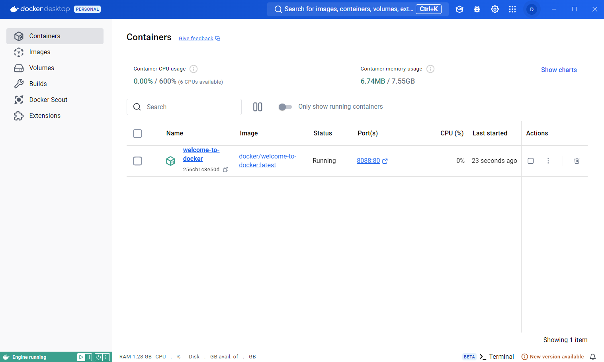 

У самому контейнері можна переглядати роботу цього контейнера, його налаштування та інший функціонал.

 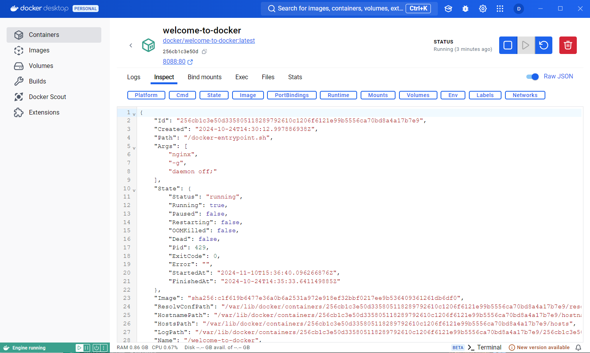 

У необхідній папці створюємо клон репозиторія для навчання та переходимо до потрібної папки.

 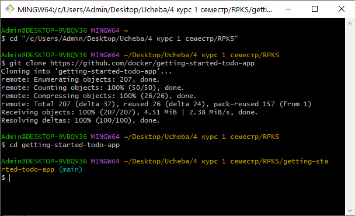 

Далі за допомогою команди "docker compose watch" ми вмикаємо спостереження за файлами в директорії.

 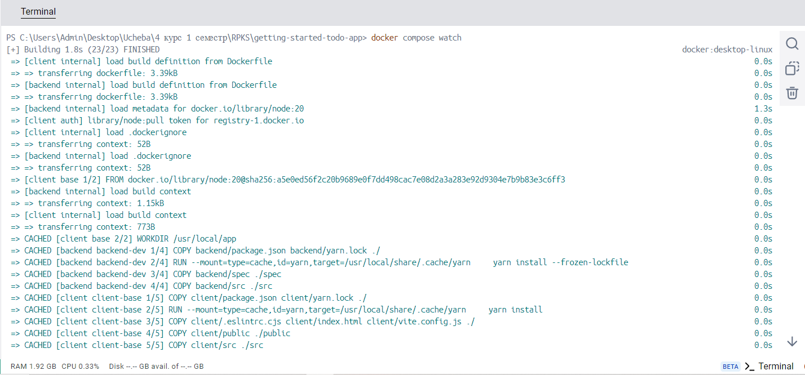 

Після виконання можна побачити, що з'явився Docker контейнер.

 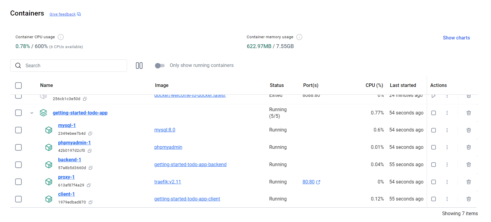 

Закінчення команди "docker compose watch".

 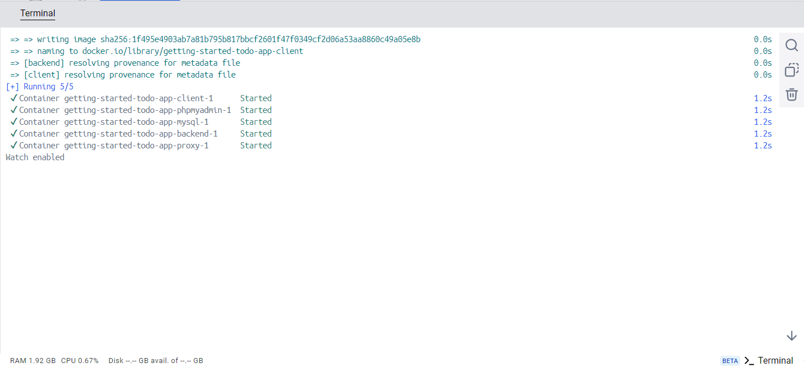 

Бачимо, що програма запустилась і все працює.

 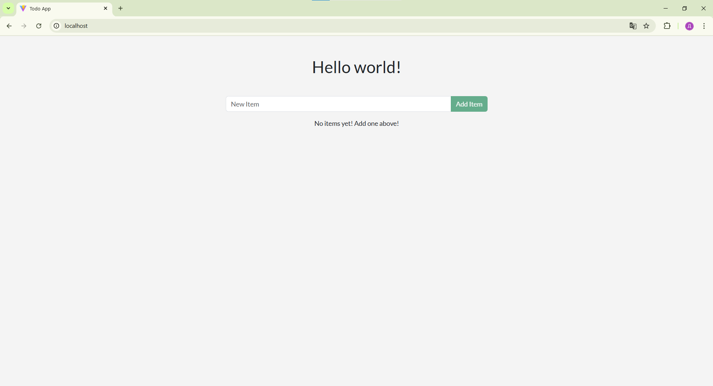 

Тепер внесемо деякі зміни у файл "backend/src/routes/getGreeting.js".

 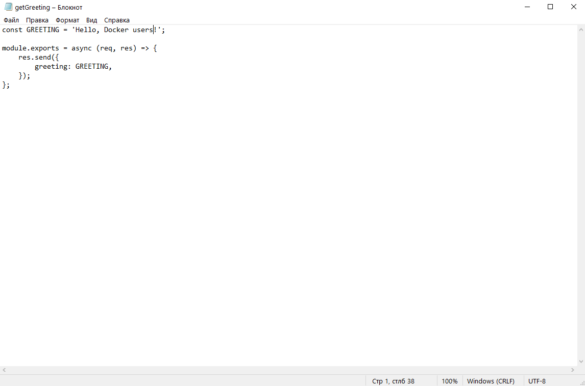 

Можна побачити, що зміни були внесені в загальний проєкт.

 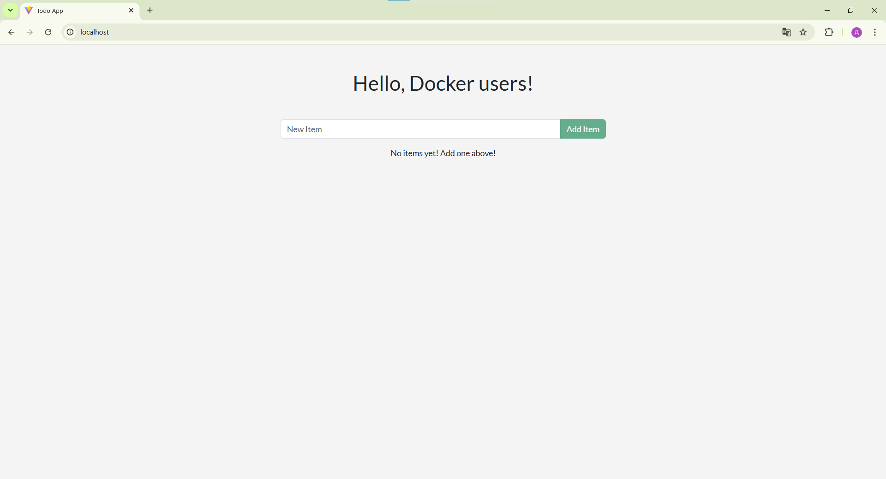 

Далі внесемо зміну плейсхолдера за шляхом "client/src/components/AddNewItemForm.jsx".

 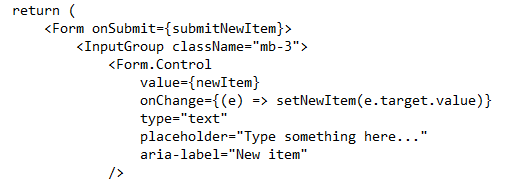 

На зображенні видно, що зміни були внесені.

 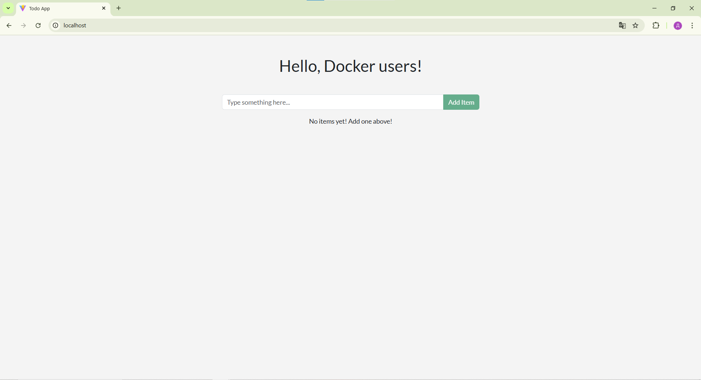 

Так само змінимо колір заднього фону на зелений. При збереженні всі зміни вносяться автоматично.

 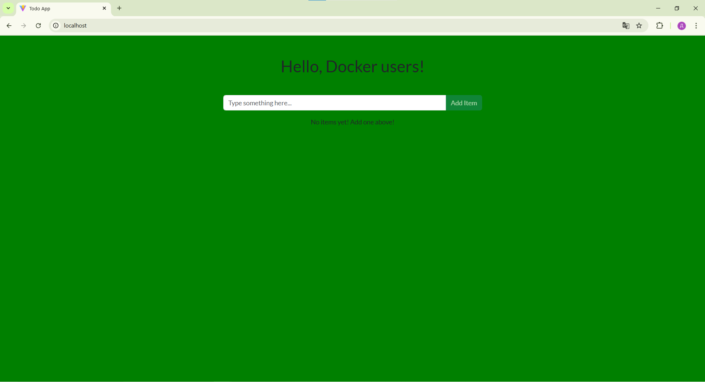 
